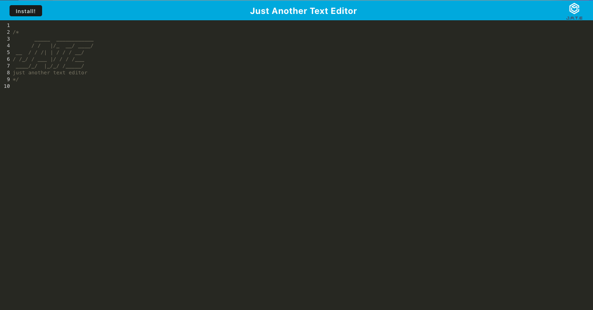

  # Just Another Text Editor

  

  ## Description
  
  This project is a Progressive Web App that allows users to write code with syntax highlighting. The main functionallity of this application however is the ability to download the application to work natively on their desktop. This is done through `webpack` and a plugin called 'webpack-pwa-manifest` which allows the application to be bundled and installed. The application also has the ability to work offline, so that the user experience remains the same with or without an internet connection, this is done through cache storage. You can view the deployed application below

  ## [Live Deployment](https://pwa-nicks-text-editor.herokuapp.com/)

  
  
  ## Table of Contents
  
  - [Installation](#installation)
  - [Usage](#usage)
  - [Contributing](#how-to-contribute)
  - [Tests](#tests)
  - [Qyestions](#questions)
  - [License](#license)
  
  ## Installation
  If you would like to clone the project and run it locally you can do so by, first cloning the repo to your local machine. Then navigate to the root directory of the repo and run the `npm install` command from the command line.
  ## Usage
  After completing the installation process you can now run `npm start` from the command line, this will run both the client and the server at the same time and begin running the application at `http://localhost:3000/` Alternatively if you would like to just use the application you can go to my deployed application [here](https://pwa-nicks-text-editor.herokuapp.com/) and click the install button located at the top left of the application, which will install the application locally on your machine.
  ## How to Contribute
  This application is solely created by Nicholas Krilis. If you would like to make changes to this project please fork the repo and submit your changes via a pull request. I will take a look and if all looks good I will merge, Thank you!
  ## Tests
  There are no testing suites associated with this project.
  ## Questions
  [Here you can view my Github Account](https://github.com/nkrilis)

  If you have any questions or would like to reach me you can contact me at [n.krilis@gmail.com](mailto:n.krilis@gmail.com?subject=[GitHub]%20Source%20Han%20Sans)

  ## License

    Copyright 2022 Nicholas Krilis

    Permission is hereby granted, free of charge, to any person obtaining a copy of 
    this software and associated documentation files (the "Software"), to deal in the 
    Software without restriction, including without limitation the rights to use, 
    copy, modify, merge, publish, distribute, sublicense, and/or sell copies of the Software, 
    and to permit persons to whom the Software is furnished to do so, subject 
    to the following conditions:

    The above copyright notice and this permission notice shall be included in all copies 
    or substantial portions of the Software.

    THE SOFTWARE IS PROVIDED "AS IS", WITHOUT WARRANTY OF ANY KIND, EXPRESS OR IMPLIED, 
    INCLUDING BUT NOT LIMITED TO THE WARRANTIES OF MERCHANTABILITY, FITNESS FOR A PARTICULAR 
    PURPOSE AND NONINFRINGEMENT. IN NO EVENT SHALL THE AUTHORS OR COPYRIGHT HOLDERS BE LIABLE 
    FOR ANY CLAIM, DAMAGES OR OTHER LIABILITY, WHETHER IN AN ACTION OF CONTRACT, TORT OR OTHERWISE, 
    ARISING FROM, OUT OF OR IN CONNECTION WITH THE SOFTWARE OR THE USE OR OTHER DEALINGS IN THE SOFTWARE.
    
  